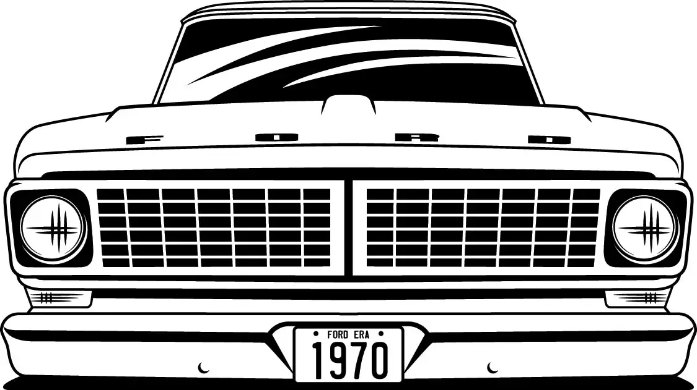
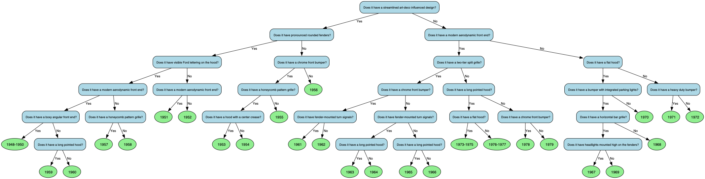

# Fordera



A one-shot machine learning pipeline that classifies Ford F-1 (1948-1952) and F-100 (1953-1979) pickup trucks by model year from front-profile illustrations, automatically generates a text-based dichotomous identification key, and then tests whether machines can use the keys they generate — all from a single illustration per truck year.

The central question: **can a vision-language model generate a purely text-based dichotomous key from images, and then use that same text-based key to identify new images?** The generated key contains no embeddings or model weights — just plain English yes/no questions like "Does it have a horizontal bar grille?" and "Does it have pronounced rounded fenders?" that a human could read on paper and follow. The pipeline then evaluates whether CLIP can answer its own text questions accurately enough to navigate the key to the correct leaf. The answer turns out to be: not very well (27% generation accuracy vs. 97% for the embedding-based classifier) — suggesting that distilling visual knowledge into text-based keys loses most of the discriminative power, and that these keys are better tools for humans than for the machines that wrote them.

The entire system is built on **one illustration per class** (27 classes, 33 images total — a few years have an alternate view). There is no training dataset in the traditional sense. The pipeline combines frozen pretrained models (ResNet-50, CLIP ViT-B/32) with one-shot cosine similarity matching, zero-shot visual question answering, and hierarchical clustering to produce both a classifier and a human-usable identification key without ever fine-tuning a neural network.

### Generated dichotomous key



## Architecture

```
                    +-----------+
                    |  Scraper  |  Download labeled images from
                    |           |  Street Trucks Magazine
                    +-----+-----+
                          |
                          v
                   +------+------+
                   |Preprocessor |  OCR detects year text overlays,
                   |             |  inpaints them out, resizes to 224x224
                   +------+------+
                          |
              +-----------+-----------+
              |                       |
              v                       v
     +--------+--------+    +--------+--------+
     |Feature Extractor |    |    Grad-CAM     |  Heatmaps showing
     |  (ResNet50)      |    | Interpretability|  which regions drive
     +--------+---------+    +--------+--------+  each prediction
              |                       |
              v                       |
     +--------+---------+            |
     |   Classifier     |            |
     | (Cosine k-NN)    |            |
     +--------+---------+            |
              |                       |
              +-----------+-----------+
                          |
                          v
               +----------+----------+
               |   Key Generator     |  Hierarchical clustering +
               | (Ward + CLIP)       |  CLIP-described splits
               +----------+----------+
                          |
              +-----------+-----------+
              |                       |
              v                       v
     +--------+--------+    +--------+--------+
     | Interactive Key  |    |  Printable Key  |
     | (HTML/details)   |    |  (SVG + PDF)    |
     +------------------+    +-----------------+
                    \             /
                     \           /
                      v         v
                  +---+---+---+---+
                  |   Marimo App  |
                  +---------------+
```

### Module details

**Scraper** (`src/fordera/scraper.py`) — Downloads 33 front-profile images from [Street Trucks Magazine](https://www.streettrucksmag.com/complete-history-of-the-ford-f-series-pickup/) covering every year from 1948 to 1979. Each image is saved with its model year label. A JSON manifest maps filenames to year labels.

**Preprocessor** (`src/fordera/preprocessor.py`) — Year text overlaid on the source images would let the model cheat (just OCR the year). EasyOCR detects text regions containing years, then OpenCV inpaints those regions. Images are resized to 224x224 for the ResNet backbone.

**Feature Extractor / Classifier** (`src/fordera/classifier.py`) — A frozen ResNet-50 (pretrained on ImageNet, never fine-tuned) extracts 2048-dimensional embeddings. Classification is one-shot cosine-similarity matching: a new image is compared against the single stored embedding per year class. No weights are learned. Data augmentation (rotation, flip, color jitter) is applied only to expand the k-NN reference set. Leave-one-out evaluation shows 97% generation-level accuracy (32/33 correct).

**Grad-CAM Interpretability** (`src/fordera/interpretability.py`) — Applies Grad-CAM to ResNet50's final convolutional layer to produce spatial activation heatmaps. These show which image regions (grille, headlights, bumper, fenders) most influence the classification. Zone-level activation scores are extracted for 13 spatial regions.

**CLIP Describer** (`src/fordera/describer.py`) — CLIP (ViT-B/32) is used zero-shot to generate human-readable questions for the dichotomous key. For each split, it compares the truck illustrations on each side against a vocabulary of 35 visual feature descriptions (grille patterns, headlight shapes, bumper styles, hood shapes, etc.) — no training or fine-tuning, just CLIP's pretrained visual-language alignment. The description that best separates the two groups becomes the question at that node. Ancestor questions are excluded to ensure diversity.

**Key Generator** (`src/fordera/keygen.py`) — Builds a balanced binary tree via Ward's hierarchical clustering on the ResNet embeddings. The tree is reordered so leaves flow chronologically (1948 on the left, 1979 on the right). Each split is labeled with a CLIP-generated English question. Outputs:
- Interactive HTML tree with `<details>` elements and example truck illustrations at each node
- Printable SVG/PDF via Graphviz

**Marimo App** (`app.py`) — Reactive notebook serving as both the development environment and end-user application. Features:
- Image upload with year prediction and confidence score
- Grad-CAM heatmap overlay
- Interactive dichotomous key with truck illustrations at decision nodes
- Downloadable PDF key

## Data

All images come from a single source: the [Street Trucks Magazine complete history article](https://www.streettrucksmag.com/complete-history-of-the-ford-f-series-pickup/). The dataset contains 33 images across 27 unique year classes:

| Generation | Years | Images | Notes |
|---|---|---|---|
| Gen 1 (F-1) | 1948-1952 | 3 | 1948-1950 share one image |
| Gen 2 (F-100) | 1953-1956 | 4 | One per year |
| Gen 3 (F-100) | 1957-1960 | 4 | One per year |
| Gen 4 (F-100) | 1961-1966 | 6 | One per year |
| Gen 5 (Bumpside) | 1967-1972 | 10 | Some years have two views |
| Gen 6 (Dentside) | 1973-1979 | 6 | Multi-year images for 1973-1975 and 1976-1977 |

## Setup

```bash
python -m venv .venv
source .venv/bin/activate
pip install -e ".[dev]"
```

## Usage

### Build the pipeline from scratch

```bash
# 1. Download images
python src/fordera/scraper.py

# 2. Mask year text and resize
python src/fordera/preprocessor.py

# 3. Train classifier (includes leave-one-out evaluation)
python src/fordera/classifier.py

# 4. Generate Grad-CAM features and overlay images
python src/fordera/interpretability.py

# 5. Build dichotomous key (downloads CLIP ViT-B/32 on first run)
python src/fordera/keygen.py

# 6. Evaluate the key as a standalone classifier (CLIP answers questions, no model)
python src/fordera/evaluate_key.py
```

### Run the app

```bash
marimo run app.py
```

### Run tests

```bash
pytest tests/ -v
```

The test suite covers:
- **Preprocessor** (8 tests) — text detection, masking effectiveness, output dimensions
- **Classifier** (8 tests) — embedding shape, prediction validity, generation-level accuracy
- **Key generator** (10 tests) — tree completeness, JSON schema, SVG/PDF output

## Key design decisions

**Why cosine k-NN instead of fine-tuning?** With one illustration per class, fine-tuning is impossible — there's nothing to train on. Cosine similarity on frozen ResNet embeddings is the natural choice for one-shot learning: store one embedding per class, compare new images by similarity. No weights are learned, no gradients computed.

**Why hierarchical clustering instead of a decision tree?** A sklearn DecisionTreeClassifier trained on the Grad-CAM zone features couldn't distinguish all 27 classes (only 6-13 zone-level features for 27 classes). Hierarchical clustering on the full 2048-dim embeddings produces a balanced binary tree where every class is reachable, and CLIP provides the human-readable interpretation.

**Why CLIP for descriptions?** The model needs to generate English questions that a human can answer while looking at a truck. CLIP bridges the gap between the embedding space (where the splits happen) and natural language. At each split, it evaluates which visual feature description best separates the two groups of truck images.

**Why mask the year text?** Several source images have the model year overlaid as text. Without masking, the model would learn to OCR the text rather than recognize visual features — achieving perfect accuracy on training data but learning nothing about truck design.

## Evaluation results

### ResNet k-NN classifier (primary model)

Leave-one-out cross-validation on the 33-image dataset. Year-level LOO is not meaningful here since most years have only one image — holding it out leaves zero examples of that year. Generation-level accuracy is the honest metric:

| Metric | Accuracy | Baseline (random) |
|---|---|---|
| Generation-level | **97%** (32/33) | 16.7% (1/6) |

32 of 33 images land in the correct generation. The single miss is the 1948-1950 F-1, whose nearest neighbor is a 1959 Gen 3 truck rather than the 1951 or 1952.

### Dichotomous key alone (CLIP as question-answerer, no classifier)

To test whether the key works as a standalone tool without the learning model, CLIP (ViT-B/32) answers each yes/no question at every decision node and follows the tree to a leaf:

| Metric | Accuracy | Baseline (random) |
|---|---|---|
| Year-level | 3% (1/33) | 3.7% (1/27) |
| Generation-level | **27%** (9/33) | 16.7% (1/6) |

The key with CLIP is above random chance at the generation level (27% vs 17%) but essentially at chance for exact years. CLIP handles the coarse splits (early round-fendered trucks vs later boxy ones) but can't reliably answer fine-grained questions like "Does it have a honeycomb pattern grille?" on small 224px crops. The key is designed for **human eyes** — a person can count grille bars and spot headlight shapes far better than CLIP's zero-shot visual QA.

Run the evaluation: `python src/fordera/evaluate_key.py`

### Iterating on key strategies

We ran eight experiments to see if different key construction or CLIP prompting strategies could improve the text-based key's classification accuracy. The question: is the 27% generation accuracy a hard limit of text-based keys, or can we do better with smarter prompting, cropping, or voting across multiple keys?

| # | Strategy | Year | Generation |
|---|---|---|---|
| 1 | **Baseline** — standard key + standard CLIP prompts | 3.0% | 27.3% |
| 2 | **Cropped to region of interest** — crop grille/bumper/hood before asking CLIP | 6.1% | 33.3% |
| 3 | **Detailed prompts** — "a front view illustration of a classic Ford pickup truck that has..." | 3.0% | 24.2% |
| 4 | **Cropped + detailed prompts** combined | 3.0% | 15.2% |
| 5 | **Complete linkage** clustering instead of Ward's | 6.1% | 30.3% |
| 6 | **Average linkage** clustering instead of Ward's | 9.1% | 27.3% |
| 7 | **Random forest of 5 keys (vote)** — bootstrap + mixed clustering, majority vote | **12.1%** | 36.4% |
| 8 | **Forest + cropping** combined | 6.1% | **42.4%** |
| | *Random chance* | *3.7%* | *16.7%* |

**Findings:**

- **Random forest of keys works** (Experiments 7-8). Building 5 different keys — using bootstrap-resampled embeddings and mixed clustering methods (Ward, complete, average) — and having CLIP walk each one, then majority-voting the result, improves generation accuracy from 27% → 36%. Different keys ask different questions along the way, so errors on any single question are less likely to kill the final prediction.
- **Forest + cropping is the best combo** (Experiment 8). Voting across 5 keys *and* cropping to the region of interest pushes generation accuracy to **42%** — a 55% relative improvement over baseline. The two strategies are complementary: cropping reduces per-question noise, voting reduces per-tree errors.
- **Cropping alone helps** (Experiment 2). Showing CLIP just the grille when asking about grilles — rather than the full truck — improves generation accuracy from 27% to 33%.
- **More detailed prompts hurt** (Experiments 3-4). Longer prompts shift CLIP's attention away from the distinguishing feature and make it worse, not better.
- **Alternative clustering methods make small differences** (Experiments 5-6). The tree structure matters less than CLIP's ability to answer the questions.
- **The ceiling is still far below the embedding classifier.** Even the best strategy (forest + cropped, 42%) is far below the ResNet classifier's 97%. The information bottleneck of converting visual features to yes/no text questions loses too much discriminative signal. These keys encode knowledge that humans can apply (count the grille bars, look at the headlight shape) but that CLIP's zero-shot visual QA cannot reliably extract from 224px illustrations.

Run the experiments: `python src/fordera/key_experiments.py`

## Algorithms and references

| Component | Algorithm | Reference |
|---|---|---|
| Feature extraction | [ResNet-50](https://arxiv.org/abs/1512.03385) (He et al., 2015) | Deep Residual Learning for Image Recognition |
| Feature descriptions | [CLIP](https://arxiv.org/abs/2103.00020) ViT-B/32 (Radford et al., 2021) | Learning Transferable Visual Models From Natural Language Supervision |
| Interpretability | [Grad-CAM](https://arxiv.org/abs/1610.02391) (Selvaraju et al., 2017) | Gradient-weighted Class Activation Mapping |
| Hierarchical clustering | [Ward's method](https://doi.org/10.1080/01621459.1963.10500845) (Ward, 1963) | Hierarchical Grouping to Optimize an Objective Function |
| Classification | [k-Nearest Neighbors](https://doi.org/10.1109/TIT.1967.1053964) with cosine similarity | Cover & Hart, 1967 |
| Text detection | [EasyOCR](https://github.com/JaidedAI/EasyOCR) | CRAFT-based text detection + recognition |
| Image inpainting | [Telea inpainting](https://doi.org/10.1016/S1047-3203(03)00009-7) via OpenCV | An Image Inpainting Technique Based on the Fast Marching Method |
| Visualization | [Graphviz](https://graphviz.org/) | Open-source graph visualization |
| App framework | [Marimo](https://github.com/marimo-team/marimo) | Reactive Python notebooks |
